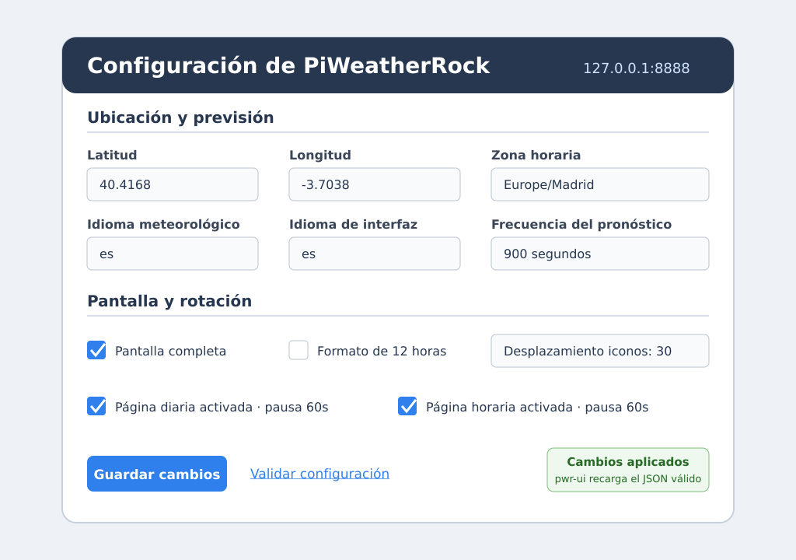
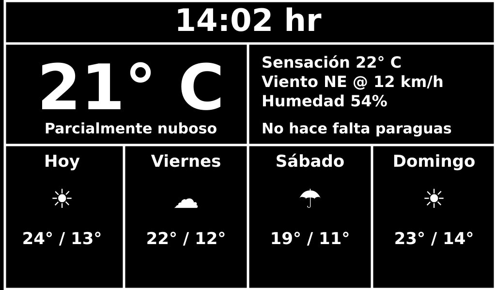
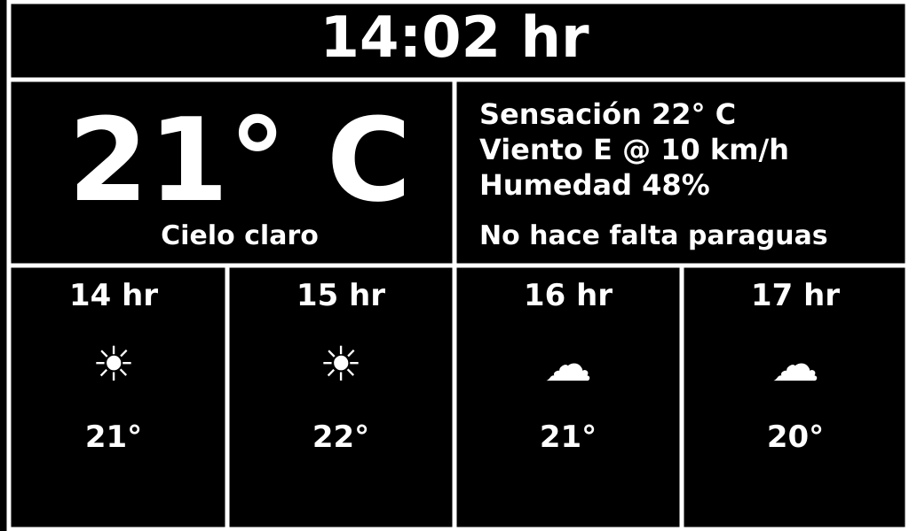
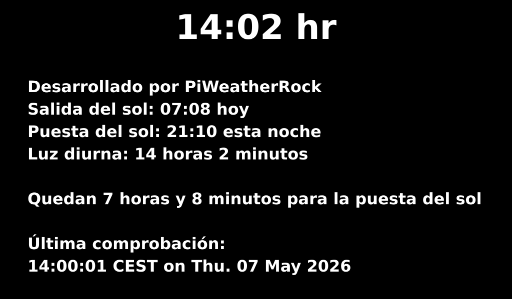

# Guía de la aplicación PiWeatherRock

Esta carpeta documenta el uso actual de PiWeatherRock y complementa las instrucciones de instalación del `README.md` principal.

## Qué muestra la aplicación

PiWeatherRock es una interfaz de pantalla completa para Raspberry Pi u otros equipos con pantalla conectada. Consulta Open-Meteo, traduce los datos al formato interno heredado de Dark Sky y alterna entre pantallas de previsión diaria, previsión horaria, información general y una pantalla opcional de medios locales.

## Instalación actual resumida

La instalación vigente usa el empaquetado definido en `pyproject.toml`.

En Raspberry Pi/Linux se puede usar el script del repositorio:

```bash
./install.sh Europe/Madrid
```

El script instala dependencias del sistema, crea el entorno virtual `~/pwr-env` e instala el paquete con `pip install .`.

Después, activa el entorno, crea la configuración desde la plantilla y ejecuta el entry point actual:

```bash
source ~/pwr-env/bin/activate
cp piweatherrock/config.json-sample piweatherrock/piweatherrock-config.json
# Edita piweatherrock/piweatherrock-config.json con ubicación, zona horaria, idioma y opciones de pantalla.
pwr-ui -c ./piweatherrock/piweatherrock-config.json
```

Para una instalación manual o de desarrollo:

```bash
python3 -m venv .venv
source .venv/bin/activate
python3 -m pip install --upgrade pip setuptools wheel
python3 -m pip install .
cp piweatherrock/config.json-sample piweatherrock/piweatherrock-config.json
pwr-ui -c ./piweatherrock/piweatherrock-config.json
```

También queda disponible `pwr-config-upgrade` para actualizar configuraciones antiguas.

## Aplicación web de configuración

PiWeatherRock incluye una aplicación web local para editar el mismo fichero JSON que usa la interfaz principal. Es útil para ajustar ubicación, idioma, zona horaria y rotación de pantallas sin modificar el archivo a mano.



### Arranque rápido

1. Instala el paquete y crea la configuración inicial desde la plantilla.
2. Ejecuta la aplicación de configuración indicando el fichero JSON:

   ```bash
   pwr-config-web -c ./piweatherrock/piweatherrock-config.json
   ```

   Si tenías scripts antiguos con `pwr-webconfig`, puedes sustituirlos por
   `pwr-config-web`, que es ahora el único punto de entrada para la
   configuración web.

3. Abre el navegador en `http://127.0.0.1:8888`.
4. Cambia los valores necesarios y pulsa **Guardar cambios**.
5. Si `pwr-ui` está en ejecución, aplicará automáticamente los cambios válidos al detectar la actualización del JSON.

### Qué se puede configurar

La pantalla web expone los campos principales definidos para `piweatherrock/piweatherrock-config.json`:

- **Ubicación:** `lat`, `lon` y `timezone`.
- **Open-Meteo:** `ds_api_key`, mantenido por compatibilidad como identificador heredado.
- **Unidades e idiomas:** `units`, `lang` y `ui_lang`.
- **Actualización meteorológica:** `update_freq`, en segundos.
- **Presentación:** `fullscreen`, `12hour_disp` e `icon_offset`.
- **Pantallas visibles y tiempos:** `plugins.daily`, `plugins.hourly`,
  `plugins.info` y `plugins.media` permiten activar/desactivar páginas y
  ajustar su tiempo de visualización.
- **Medios locales:** carpeta, orden aleatorio, modo de ajuste y extensiones
  permitidas para `plugins.media`.
- **Diagnóstico:** `log_level`.

### Validación y guardado

Al guardar, la aplicación carga el JSON actual, convierte los valores del formulario al tipo esperado, valida la configuración y escribe el fichero de forma atómica. Si ya existía un fichero de configuración, se conserva una copia con sufijo `.bak`.

El enlace **Validar configuración** abre `/status` y devuelve:

- `OK: configuración válida...` cuando el JSON cumple los requisitos.
- `ERROR: ...` con código HTTP 400 si falta un campo, hay un tipo incorrecto o algún valor está fuera de rango.

Si el JSON queda inválido mientras `pwr-ui` está funcionando, la interfaz principal mantiene la configuración activa anterior y registra el error en lugar de aplicar el cambio defectuoso.

### Seguridad de red

Por defecto, la aplicación escucha solo en `127.0.0.1:8888`, es decir, únicamente desde la propia máquina:

```bash
pwr-config-web -c ./piweatherrock/piweatherrock-config.json
```

Solo usa `--host` si necesitas acceder desde otro equipo de tu red y entiendes el riesgo de exponer la configuración:

```bash
pwr-config-web -c ./piweatherrock/piweatherrock-config.json --host 0.0.0.0 --port 8888
```

En ese caso, limita el acceso a una red de confianza y cierra la aplicación cuando termines de configurar.

### Flujo visual recomendado

```text
config.json-sample
        │
        ▼
piweatherrock-config.json ──► pwr-config-web ──► Guardar / validar
        │                              │
        └──────────── pwr-ui detecta cambios válidos ────────────┘
```

## Pantalla de previsión diaria

La pantalla diaria combina la hora, la temperatura actual, el resumen meteorológico, viento, humedad y aviso de paraguas con la previsión de hoy y los tres próximos días.



## Pantalla de previsión horaria

La pantalla horaria mantiene el bloque superior de condiciones actuales y sustituye la franja inferior por la previsión de las próximas horas. Se puede alternar manualmente con la tecla `h`.



## Pantalla de información

La pantalla de información reduce el contenido visual para ayudar a evitar quemados de pantalla. Muestra hora, salida y puesta de sol, duración de la luz diurna y hora de la última actualización. Se puede abrir con la tecla `i`.



## Pantalla de medios locales

La pantalla de medios locales funciona como marco digital. Lee imágenes y vídeos cortos de una carpeta local configurada en `plugins.media.path`, que debe existir antes de activar `plugins.media.enabled`, los escala a la pantalla y permite elegir el modo de ajuste:

- `contain`: muestra el archivo completo con bandas si hace falta.
- `cover`: llena toda la pantalla recortando lo necesario.
- `stretch`: ajusta al tamaño de pantalla deformando si la proporción no coincide.

Las imágenes soportadas son `jpg`, `jpeg`, `png`, `gif` y `bmp`. Los vídeos configurados (`mp4`, `mov`, `m4v`, `avi`, `webm`) se reproducen mediante `ffmpeg` si está instalado en el sistema; si no está disponible, la pantalla muestra un aviso. Se puede abrir manualmente con la tecla `m`.

## Controles principales

- `d`: cambia a previsión diaria.
- `h`: cambia a previsión horaria.
- `i`: cambia a información general.
- `m`: cambia a medios locales.
- `s`: guarda una captura como `screenshot.jpeg`.
- `q` o Intro del teclado numérico: cierra la aplicación.

## Configuración relevante

Los valores se editan en `piweatherrock/piweatherrock-config.json`:

- `lat` y `lon`: coordenadas de la ubicación.
- `timezone`: zona horaria, por ejemplo `Europe/Madrid`.
- `lang` y `ui_lang`: idioma de los datos meteorológicos y de la interfaz.
- `units`: sistema de unidades; `si` usa métricas.
- `fullscreen`: ejecuta en pantalla completa si es `true`.
- `update_freq`: frecuencia de actualización de Open-Meteo en segundos.
- `plugins.daily`, `plugins.hourly`, `plugins.info` y `plugins.media`: activación y tiempo de permanencia de cada pantalla.
- `plugins.media.path`: carpeta local desde la que se leen imágenes y vídeos cortos.
- `plugins.media.shuffle`: alterna el orden secuencial o aleatorio.
- `plugins.media.fit`: modo de ajuste (`contain`, `cover` o `stretch`).
- `plugins.media.extensions`: extensiones permitidas separadas por comas.

La aplicación web `pwr-config-web` permite editar qué pantallas se visualizan y el tiempo de visualización de cada una. La interfaz soporta tema claro y oscuro, con un botón de alternancia y detección automática de la preferencia del sistema. La configuración se recarga automáticamente en la UI principal cuando el JSON actualizado es válido.
